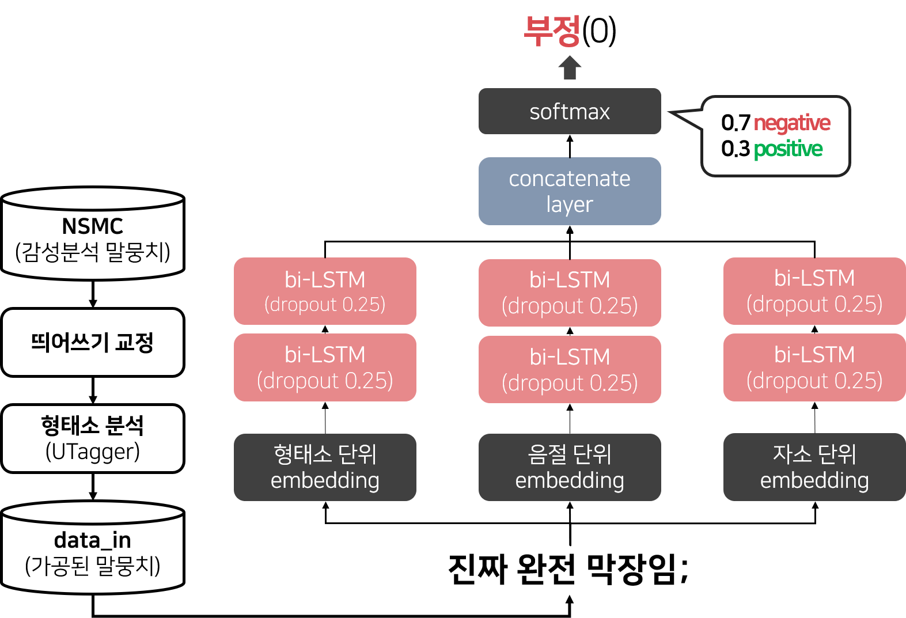

# sentiment-analysis2

NSMC(Naver Sentiment Movie Corpus)를 활용한 Parallel stacked BiLSTM Sentiment Analysis ver2
- NSMC : https://github.com/e9t/nsmc
- sentiment analysis ver1(BiLSTM-attention) : https://github.com/seoyeon960406/sentiment-analysis

### Data
NSMC에 대해 띄어쓰기 교정 및 형태소 분석을 완료한 데이터를 사용(data_in)

- 띄어쓰기 교정 : __[확률기반 띄어쓰기 모델](https://www.dbpia.co.kr/journal/articleDetail?nodeId=NODE09874447)__ (추후 UTagger의 기능으로 추가 예정)
- 형태소 분석 : __[울산대학교의 형태소 분석기 UTagger](http://klplab.ulsan.ac.kr/doku.php?id=start)__

### Package
- tensorflow v1.15
- gensim
- numpy

### model

### References
- [Naver AI hackathon 2018](https://github.com/moonbings/naver-ai-hackathon-2018/tree/master/movie) : 자소 단위 분리를 위해 사용
